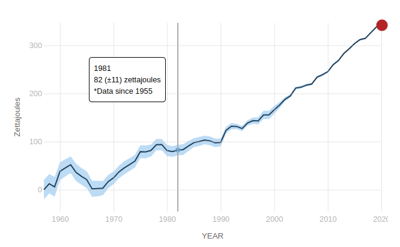
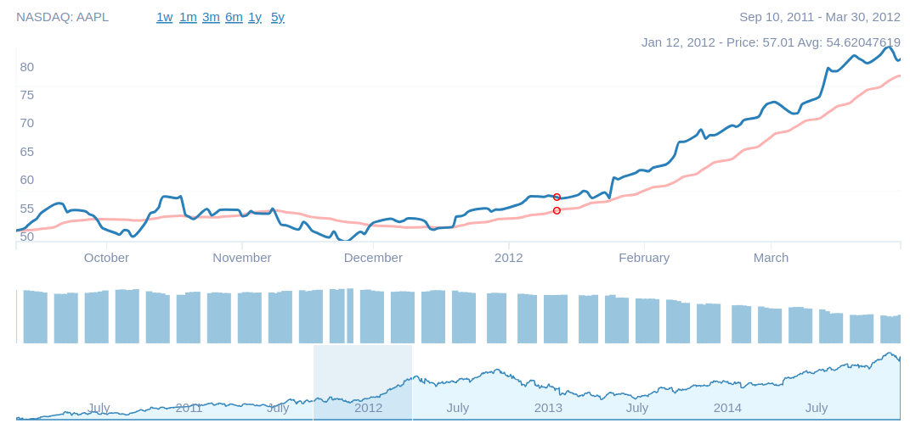
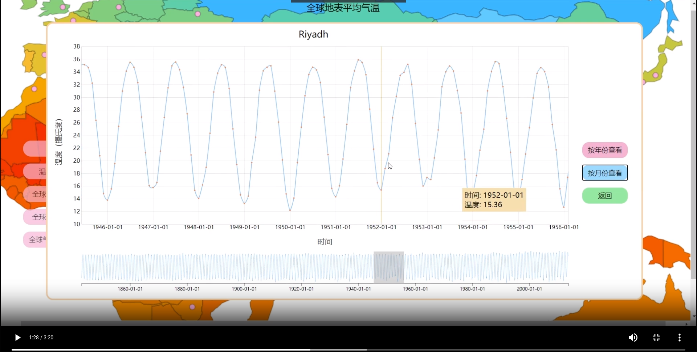
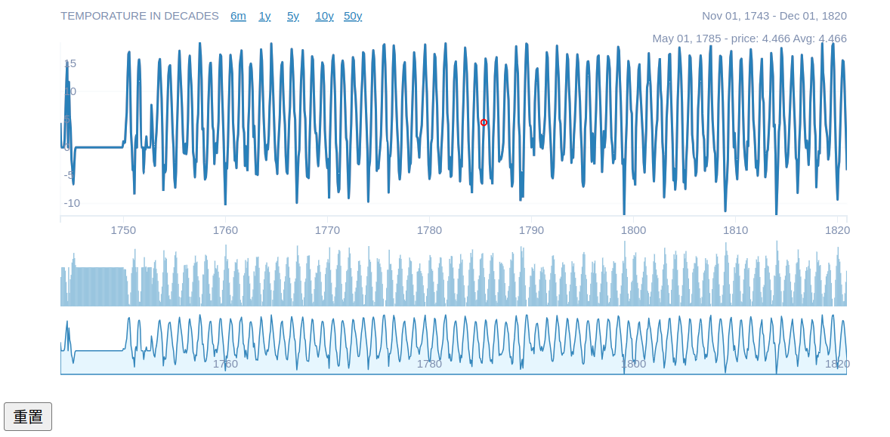

## 基本思路

如果无法访问国外网站，必应搜索“如何配置clash for windows”，下载并配置好

如果要买clash节点：https://yuritele.com/ ，一个我觉得很便宜的网站，选20元 128GB/年 即可

基于清华大学“全国城市空气质量数据可视化、全球气温变化温室气体排放可视化及分析”项目（主要是后者）做一个全球环境数据可视化图

实现内容：

- 可缩放的世界地图，鼠标悬停于某地区会显示该地区的数据
- 可点击、拖拽实现缩放的折线图，或者像[股票折线图](https://github.com/arnauddri/d3-stock)一样内容丰富的折线图
- 对数据进行分析得出来的一些图表，比如heatmap（其实就是一个矩阵，矩阵元素是两个因素的相关性）或其他

数据网站：

- https://climate.nasa.gov/vital-signs/carbon-dioxide/

  类别：Carbon Dioxide, Global Temperature, Methane, Ocean Warmng, Ice Sheets, Sea Level, Arctic Sea Ice Minimum Extent

  有txt数据，一些是全球一些不是，页面上对折线图Click+drag to zoom的功能实现

  且这个网站主打环境保护，可以找到相当多的基于网站给出的数据的环境保护分析和论文（希望我们不用看）

- https://climatedata.imf.org/pages/climatechange-data

  有许多好看的图表，可以下载csv

- Kaggle

  https://www.kaggle.com/search

  搜索climate，我只觉得那个2k赞的有点用

- https://berkeleyearth.org/data/

  Kaggle上最大的地表温度数据集的数据来源，还没细看

还没确定是否有用的网站：

- https://www.climate.gov/maps-data/all
- https://climateknowledgeportal.worldbank.org/download-data world bank网站

可参考的github项目：

点击github页面右边的链接可以直接访问仓库对应的可运行的demo/网站

- https://github.com/bartromgens/climatemaps ，一个动态的气象地图，有各种炫酷的功能
- https://github.com/MaayanLab/clustergrammer ，炫酷的动态heatmap，做heatmap时可参考效果
- https://github.com/arnauddri/d3-stock ，信息、形式都比较丰富的股票折线图

## 折线图基本要求

1. x方向时间比例尺、y方向数值比例尺的正确显示

   参考：https://climate.nasa.gov/vital-signs/carbon-dioxide/

2. 鼠标位于某一时间刻度时显示信息，对于有+-值的数据用颜色表示数据范围

   参考：https://climate.nasa.gov/vital-signs/ocean-warming/

   

3. 实现缩放功能，包括滚轮缩放、选中某一时间范围则将该时间范围内的折线图作为svg显示的全部内容，添加过渡动画；实现RESET按钮

   参考：https://climate.nasa.gov/vital-signs/ocean-warming/ ，或者https://cg.cs.tsinghua.edu.cn/course/vis/portfolio.html 中"全球气温变化温室气体排放可视化及分析"这个项目中折线图选择区域的方式

4. 整合更多图表到折线图中，实现直接显示不同时间尺度的按钮（比如x方向的时间尺度为day, month, half year, year, decade显示等等）

   参考：https://github.com/arnauddri/d3-stock/ ，这个项目给的demo链接不太行，建议自己clone到本地运行index.html

   

   这幅图从上到下以此为：局部折线图、局部柱状图、总体折线图。局部折线图显示的是总体折线图选中的内容

5. 可以自己在github上找找其他酷炫的使用d3绘制折线图或时间序列的项目

6. 学d3基础知识可以参考https://www.bilibili.com/video/BV1qg411X7bB 及其简介中的仓库，想实现某一功能可以先去github上找找有没有现成的代码

7. 另一个可参考的图：https://cg.cs.tsinghua.edu.cn/course/vis/portfolio.html -> 全球气温变化温室气体排放可视化及分析

   

8. 改进意见：

   

   - 横轴和纵轴没有标签说明
   - 重置、不同时间跨度按钮可以放在更紧凑的地方。。比如时间跨度旁边明明有空干嘛不放重置（当然也可以参考第7条中的图片放在折线图旁边，我觉得这样按钮更明显更美观）
   - 显示界面的按钮、说明和日期等文字中英文混合，建议全英文
   - 添加图表标题
   - 删除柱状图
   - 最下方的折线图的面积的意义是什么，如果没有可以不用显示面积
   - 右上方还有显示price。。
   - 感觉鼠标选中某点后还是让该点的信息（日期、温度）显示在该点旁边比较好，参考第7条中提到的演示视频

9、反馈

1.  以上建议第一、三、五、七、八条均已解决。、

2. 第二条关于按钮放置位置问题 ，可以等折线图能在主界面显示出来，再合理规划位置。

3. 第四条同第二条原因。（且每个图的名字不太一样，可以跟按钮一起处理）。

4. 第六条：最下方这折线图展现的是整个折线图的全览，也是区域选择的地方，因此不可删去。

5. 目前问题：

   ①折线图接入接口后出现以下报错

考虑是否是min.js的问题，并且我们的折线图的函数已经对缺省值已经进行了处理。

  ②给同伴的建议。

当按下animate按钮后滑块无法对准月份，且在Dec之后还会继续变化，是否是滑块和标签未对准的问题。