# 数据可视化报告

组名：如来佛祖

 队员：王浩（2013287） 谢可洁（2213787） 唐苇苇（2212138）
（注：md文档可看出可视化图像的动态效果，pdf文档只能看到可视化图像的静态效果）

## 项目运行方式

非npm项目，只需要在vscode使用live server中运行renderearth.html即可。写html时因为使用了绝对位置可能会有一些位置上的偏差，但总体上看上去应该是如下样子的：

github链接：https://github.com/water-00/data-visulization-project

## 一、项目简介

####  项目背景
自19世纪中期，科学家们开始注意到工业革命后大气中的二氧化碳浓度的升高，到1988年联合国环境规划署和世界气象组织共同成立“IPCC”，再到2015年各国签署巴黎协定，全球气候变暖的议题一直受到世界范围内的广泛关注。自2003年起中国重庆等地、美国两百多个地区、日本埼玉县等地屡次创下了历史最高气温，极端天气已经影响到了人类生产生活。本项目旨在通过收集相关数据，以可视化的方式展现近60年间全球气温的变化情况并以气温变化为支点，正向分析全球气候变暖带来的极端天气等现象，逆向回溯温室气体等“元凶”的排放情况。
####  项目价值与应用
本项目的价值希望通过图表和地图，直观地呈现全球气候变暖的关键指标和趋势，使公众更容易理解气候变暖的现状和影响，从而促进公众更加关注并支持应对措施；为政府和国际组织提供全面、准确的数据视图，对过往的气候政策进行反思，有助于制定更加科学、有效的气候政策和行动计划；为企业提供气候相关数据，助力其评估风险、开展绿色转型，并满足投资者和消费者对可持续性的要求。
## 二、分析目标
* 全球温度趋势的分析及特定地区的温度趋势分析
* 温室气体排放情况分析
* 全球气候变暖效应情况分析
* 全球气温升高与温室气体排放种类关联，极端天气与全球气候变暖的关联性分析
## 三、数据描述
#### 数据来源
* 来自NASA气候网站中（https://climate.nasa.gov/vital-signs/carbon-dioxide/） 1880到2020年中二氧化碳、甲烷等温室气体的排放量，以及海平面，冰川消融等数据。（以下记为：数据集①）
* Kaggle网站上世界资源研究所发布的温室气体历史排放数据（https://www.kaggle.com/datasets/saurabhshahane/green-house-gas-historical-emission-data）  （以下记为：数据集②）
* Kaggle网站上来源于Sevgi Sarac的数据（https://www.kaggle.com/code/sevgisarac/climate-change）数据集中包含了关于气候变化的数据分析和可视化，特别是关注二氧化碳排放、全球气温变化以及它们之间的关系（以下记为：数据集③）
#### 数据处理
根据分析目标，所有表格数据均使用.csv格式，地图数据使用geoJSON格式。
1. **绘制地图数据处理**

    从网络上下载包含各个国家详细边界的geoJSON数据，使用[topojson](https://github.com/topojson/topojson)库进行处理得到用于绘图的path的d属性；使用墨卡托投影绘制世界地图。

2. **绘制地图上温度变化的数据处理**

    数据来源于kaggle，即数据集③，该数据集记录了从1960到2019年各个国家的平均气温与该地区历史上百万年的平均气温的偏差，以反映某国家所处地区的气候变暖情况。通过在js中实现交互和动画，我们最终动态展示了这60年间世界各国的气候变暖程度。

3. **绘制各个国家温度变化的数据处理**

    也是来源于数据集③，点击国家后则弹出一个div容器，在容器内进行可交互的折线图的绘制。折线图的交互参考项目[d3-stock](https://github.com/arnauddri/d3-stock).

4. **绘制全球气温升高与温室气体排放种类关联，极端天气与全球气候变暖的关联的数据处理**

    根据数据集②、数据集①得出某年份中各个国家某一类温室气体的排放量并计算平均值，从而得到1990年到2014年各个种类温室气体世界平均排放量，利用SPSS分析各个温室气体的排放量与温度之间的相关系数。（极端天气等全球变暖现象与温度的处理方式同理）

 得到相关系数结果如下：

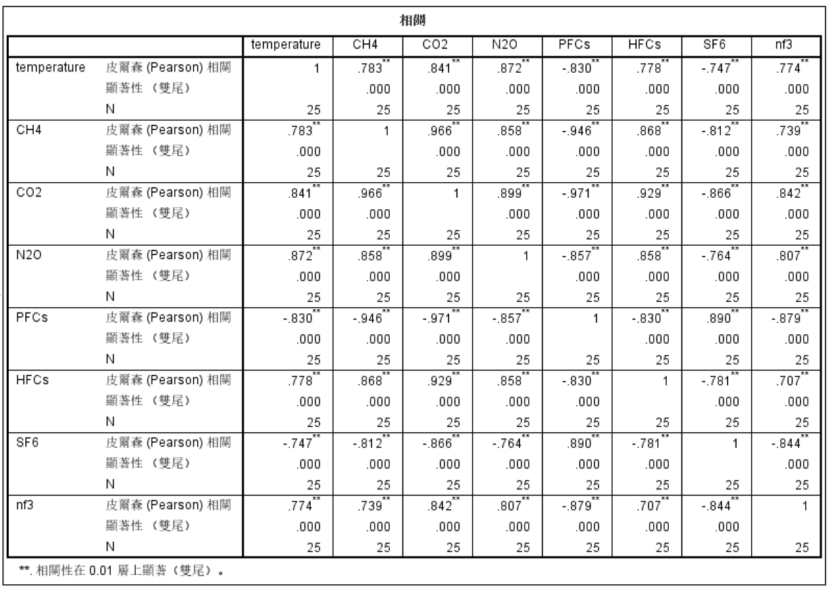

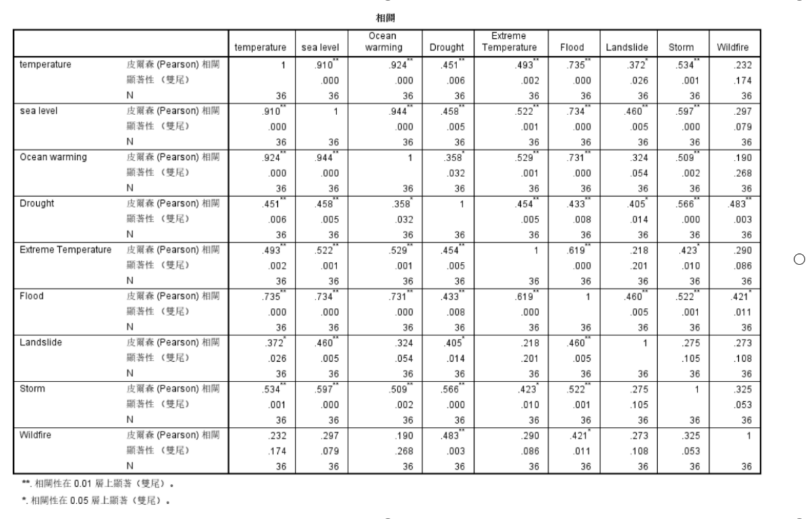
5. **绘制全球变暖效应情况折线图的数据处理**
该数据集结构良好，数据完整，符合我们相关可视化图像的绘图要求，直接使用进行绘图。

## 四、可视化显示与交互设计
#### 页面总体介绍

* **视图设计**

本项目以两个页面进行展示，主界面如下（这一张图的动图请看md）：

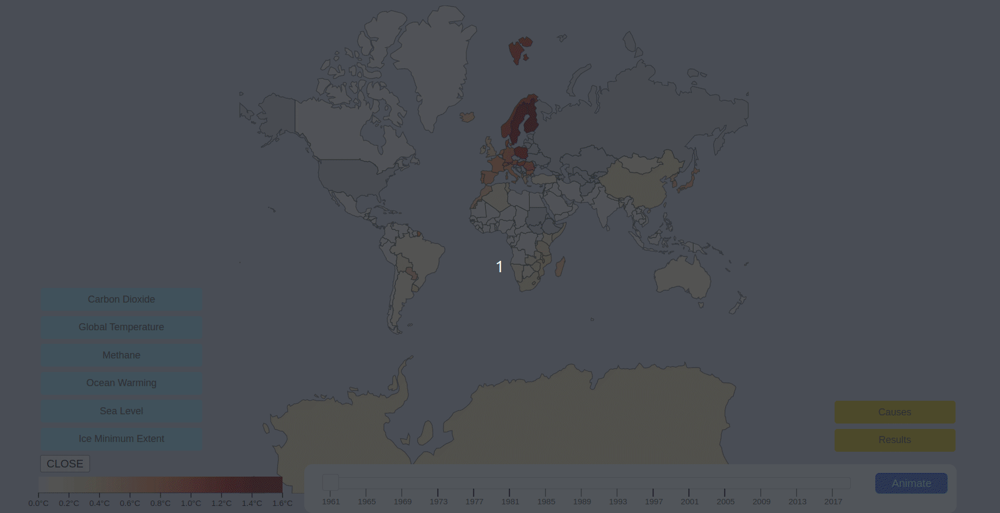

主界面展示的是自1961年来全球各国各地区每年气温相较于历史平均温度偏差值（以下简称：温度偏差值）的全球地图，拖动下方滑块可以定位到某一年，观察当年。整体界面以红色系为基调，当偏差值越高，红色越深。可以从视觉上给予用户关于温度差值过高的冲击和“警示”的心理暗示。

点击Animate按钮，可以使滑块自动从1961年开始到2019年移动，使得图像自动从1961开始展现到2019年间偏差值的变化情况。此动态效果从视觉上直观的告诉用户，随着时间推移，全球各地红色越来越深，也意味着全球最高气温不断上升的情况越来越严峻。

* **交互设计**

当鼠标悬停在某一国家的色块上时，会出现该年份该国家当年气温相较于前一年的温度差值，实现用户与图表的交互。当点击该国家区域时，会自动跳转到该国家1961~2019年最高气温相较前一年的温度差值的折线图。

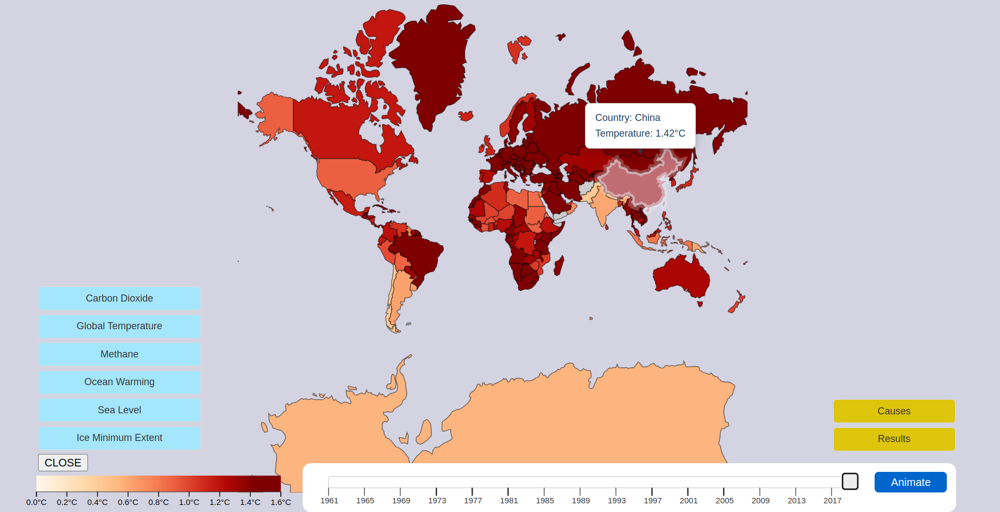

在该界面的左下方跳转全球变暖效应情况折线图的按钮，点击按钮可以跳转相应折线图。

在该界面的右下方是跳转分析温室气体排放和极端天气与全球气温升高的折线图的按钮，点击该按钮即可跳转到另一个页面，该页面展示的是温室气体排放与气温升高的相关性热力图和气温升高与极端天气的相关性热力图。

#### 1961~2019年各国最高温度较历史均温变化折线图

* **视图设计**

  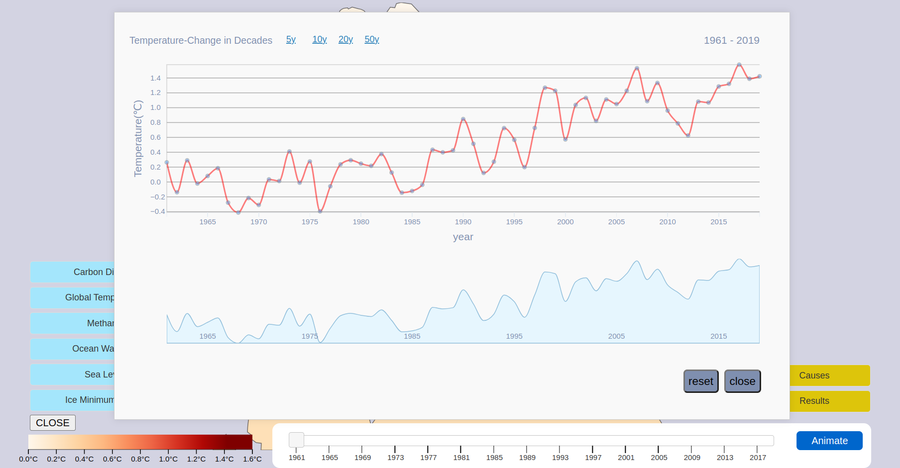

  该折线图是中国自1961年到2019年各年最高气温相较于历史均温的温度偏差值的折线图。横坐标表示的是年份（1961到2019），纵坐标表示的是温度偏差值变化情况，折线图上绘制的是1961~2019年间温度差值的变化情况。折线图下方的区域图展现的是整个时间段内，温度差值的变化情况，主要是为交互服务。

* **交互设计**

  * 当鼠标悬停在折线图上的小圆圈时，会出现展示当年数据的标签，使得用户能够直观的获取想要的数据。

  * 在整个折线图的上方，有一排标签，点击该标签可以出现以5年、10年、20年、50年为整个时间范围的温度差值情况。点击标签之后，下方会出现一个阴影框，可以自由拖动阴影框，展示不同年份的温度偏差值情况。右上角的标签表示的就是当前折线图中跨越的年份。

    下图为点击20年跳转的图：

    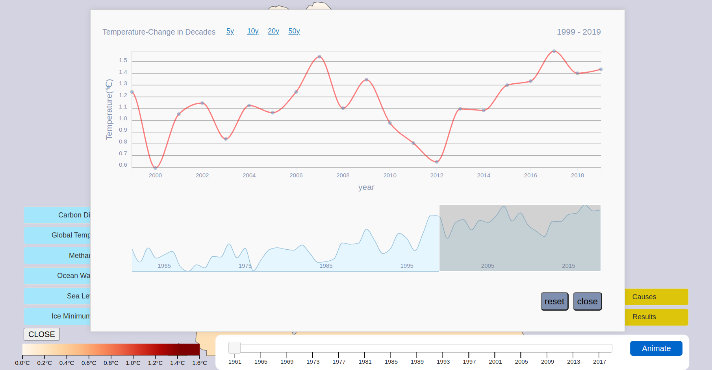

    

    折线图的右下角的“reset”和“close”按钮，点击“reset”可以将折线图恢复到全貌，点击“close”可以关闭当前折线图的窗口。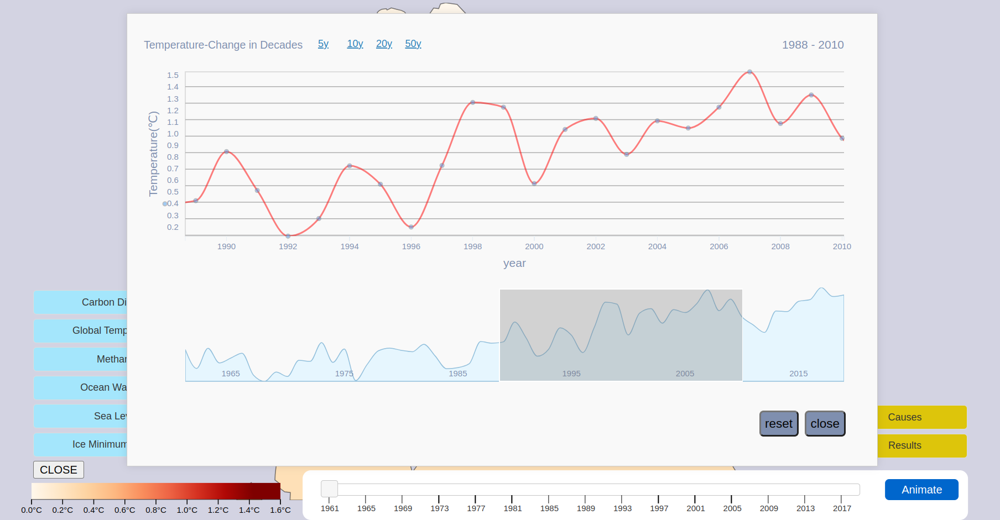

#### 全球温室气体排放折线与全球气候变暖效应情况折线图
* 视图设计

  下图为空气中二氧化碳的含量的折线图

  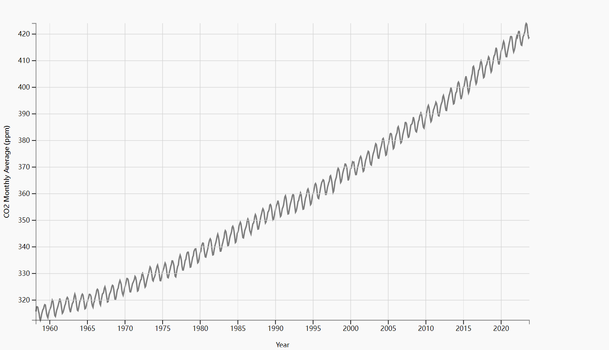

  下图为1880到2020年平均气温图

  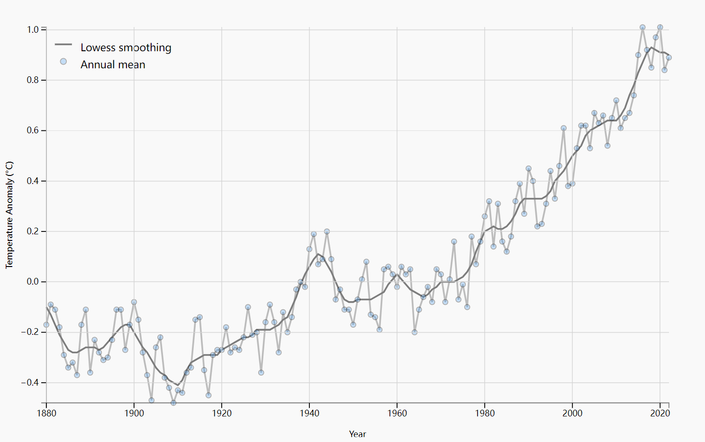

  下图为空气中甲烷含量图：

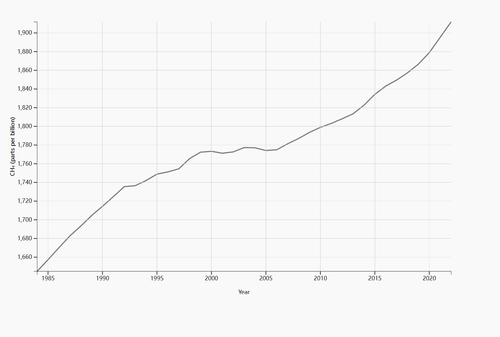

下图跟踪了 1992 年至 2019 年整个水柱（从海洋顶部到底部）的海洋热含量的变化，

（蓝色阴影表示不确定度）

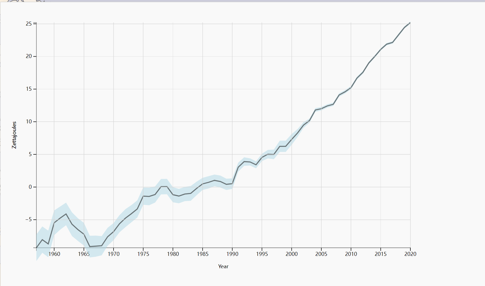

下图是自1993年以来全球海平面的变化（蓝色阴影代表不确定度）

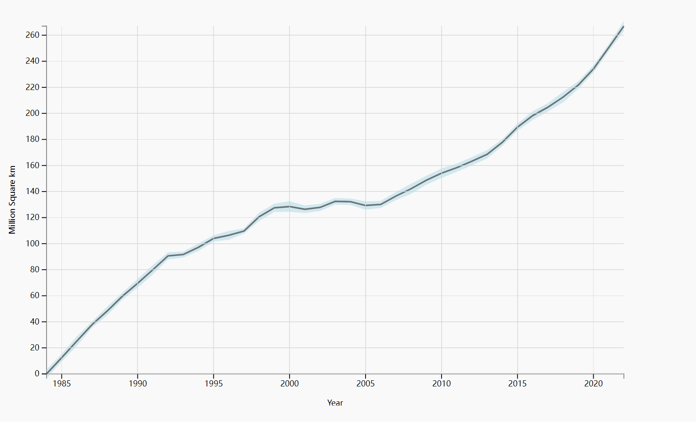

下图为自 1979 年开始卫星观测以来每年 9 月北极海冰的大小。

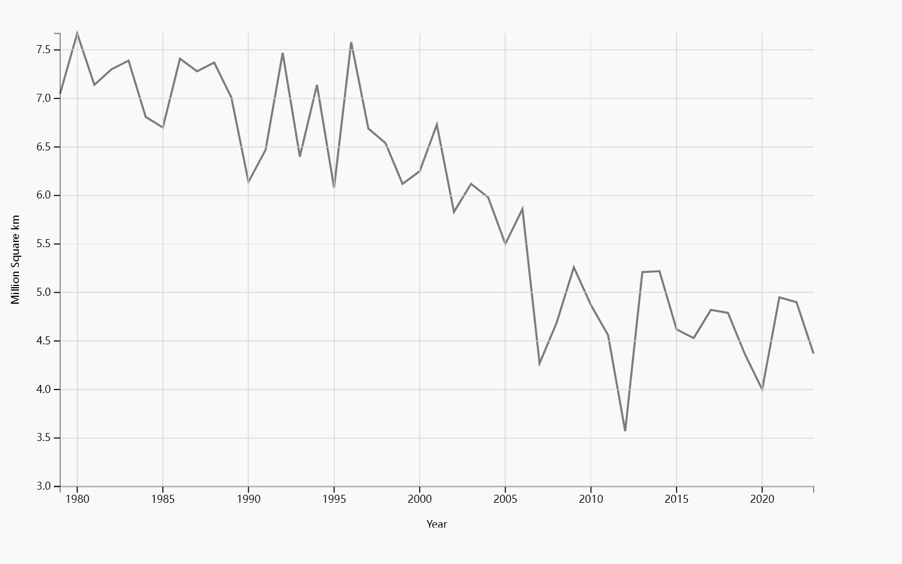

本系列折线图均采用简约风格，使用白底黑字，横坐标代表年份，纵坐标代表相应指标的变化范围，以求能更清晰的展现相应情况的变化。

#### 温室气体排放与气温升高的相关性热力图和气温升高与极端天气的相关性热力图

* 视图设计

  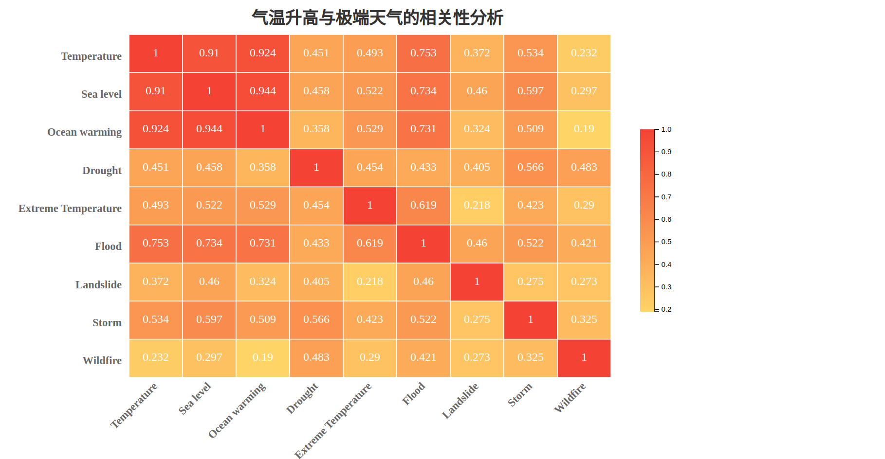

  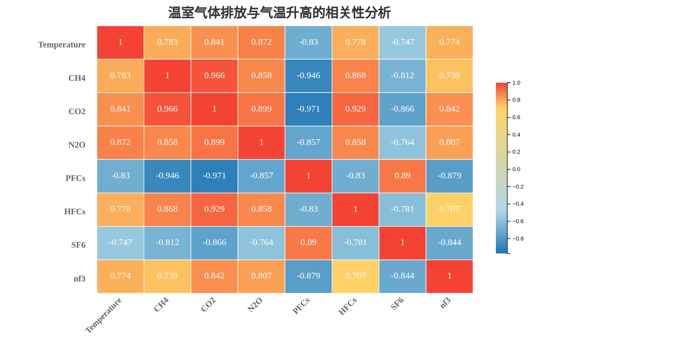
  
  选择红色渐变和蓝色渐变来分别表示正相关程度和负相关程度，颜色越深表示相关性越高。在这个热力图的每一个矩形中可以显示两个因素之间的相关性的数值。

## 五、基于项目成果的分析与发现

1. **分析目标一：全球温度趋势的分析及特定地区的温度趋势分析**

  * **目标实现**

    通过分析主界面中映射每一年最高温度相较历史温度的偏差值的全球地图，可以发现几乎大部分国家的颜色随着颜色推移都不同程度的逐渐变深。这直观的表示了自1961年来大部分国家都出现了最高温度不断上升的情况，并且上升幅度在不断增大，这反映了1961年到2019年全球各国家地区最高温度不断上升的现状。
    
    本报告分析中国的各年偏差温度差值的折线图。通过折线图可以发现我国各年的温度差值是在不断波动的，但总体趋势是不断上升的。这表明我国的最高气温也在不断上升，间接说明我国同样面临着较为严重的气温升高问题，值得有关部门予以重视。
    
  * **发现**
    我们从该图中还发现欧洲大陆、北美地区，北非地区以及亚洲俄罗斯、中国等国红色程度率先变深，这可能与这些国家地区在1961年之后工业较为发达，温室气体等排放量较多相关。 

2. **分析目标二：温室气体的排放情况**
* **目标实现**
本项目中关注的温室气体包括二氧化碳、甲烷等。通过可视化的图表我们可以直观的看出自1960年开始，空气中二氧化碳的含量在波动中不断上升。空气中的甲烷含量自1985到2022年开始也在不断升高，在2005年之后增速明显加快。由图可知，自全球大部分国家开始发展工业以来，二氧化碳等温室气体的排放量不断升高导致空气中二氧化碳的含量不断升高。
* **发现**
  * 2005年之后空气中甲烷含量的明显升高可能与化石燃料的使用增多；全球肉类消费增多，而牛的消化过程也是产生甲烷的重要来源；全球湿地的减少等因素有关。
  * 无论是甲烷还是二氧化碳，其空气中的增长趋势都与全球平均气温的增长趋势相符合，我们有充分理由怀疑全球平均气温升高与温室气体的排放增多有关。
3. **分析目标三：全球气候变暖效应情况分析**
* **目标实现**

  根据折线图，可以发现海水已经在以相对较快的速度变暖，90%的全球变暖发生在海洋中，自1955年开始现代记录以来，导致水的内部热量增加。；在1985年到2005年，海平面在不断升高，速度却逐渐变缓，在2005年之后，海平面上升速度变快，并且正在以更快的速度上升。每年 9 月，北极海冰都会达到其最小范围（卫星传感器显示单个像素至少 15% 被冰覆盖的区域）。与1981年至2010年期间的平均程度相比，9月北极海冰现在以每十年12.2%的速度缩小。这些趋势都与不断上升的全球温度相关，全球气温显示了与1951年至1980年长期平均值相比，全球地表温度的变化。2020 年在统计上与 2016 年并列，是自 1880 年开始记录以来有记录以来最热的一年。折线图分别从冰盖，海洋等方面都展现了全球气候变暖对地球带来的实质性影响。
4. **分析目标四：全球气温升高与温室气体排放种类关联，极端天气与全球气候变暖的关联性分析**
* **目标实现**
  通过分析全球平均气温与甲烷、二氧化碳、一氧化二氮等温室气体的相关系数，并将其可视化为一张热力图表，通过红色的深浅，来表示相关性的强弱。由图观之，二氧化碳、甲烷两类气体与温度相关性最高，以此为据支持前文全球平均气温升高与温室气体含量增多的猜想。

  通过分析极端天气与全球气候变暖的关联性发现：海平面上升、海水温度升高、   洪水等极端现象与全球气温相关性很强，干旱、飓风、极端气温等极端天气相关性较强。这些极端现象与全球气温表现出来的关联性值得有关部门思考，当我们预防干旱、洪水等自然灾害时，应考虑到全球气候变暖这一诱因。

* **发现**
 观察温室气体排放与温度的相关性，可以发现PFCs（全氟化合物）、SF6（六氟化硫）等气体与温度呈现负相关，通过查询资料得知PFCs、SF6均为强大的温室气体，引起温室效应的能力非常强。现已经被多个国家和地区采取措施限制使用，故与温度呈现负相关。

5. **本项目总体发现**
以全球1961年到2019年的各年最高气温与历史均温的偏差值为核心，展现了1961年到2019年以来全球最高温的变化情况，以此情况为轴，本项目正向分析了最高温度升高为表象的全球气候变暖带来的极端天气等影响，又逆向回溯了全球气候变暖的诱因——“温室气体”，通过这样正逆结合的分析，得出了部分极端天气与气温升高极强的相关性，以及部分温室气体排放与气温升高的相关性。通过这些分析我们发现，在过往关于全氟化合物等温室气体的排放方面一定程度的抑制了气温升高的速度，但是在其余温室气体，如：二氧化碳的排放方面，希望有关部门能予以重视。温室气体带来的全球温度升高，再导致了极端天气、冰川消融等现象。希望人们能从这条因果链着手，从根源延缓全球气温升高，进而减少极端天气的而发生，保护好我们唯一的地球家园！